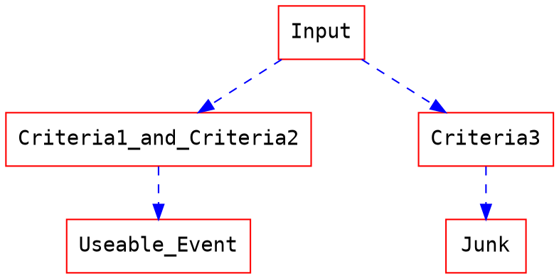

# HEP-jet-assignment
---

Top jet assignment - Data preparation
===
- [Top jet assignment - Data preparation](#heading)
  * [Generate Monte Carlo data](#heading-1)
  * [Analysis `.root` file to get the event record](#sub-heading-1)
  * [Output event record](#sub-heading-2)
  * [Appendix](#sub-heading-3)


## Generate Monte Carlo data 
To generate MC data, we will follow the following process.

* Demand Process: $p p \to t \bar{t} \to W^{+}bW^{-}\bar{b} \to q\bar{q}bq\bar{q}\bar{b}$ (full hadronic channel, 6 jets)
* Generaing tools: MadGraph@NLO v2.7.3, Pythia 8, Delphes.
* Environment: Docker with CentOS 8 image.
* Event level: Parton level(i.e. w/o consider QED and QCD)
* Shower: On
* Number of events: 1 millions.
* Jet algorithm: anti-KT algorithm with $\Delta R$ < 0.4

The script we used to generate the data:
```
#Setting the event process with full hadronic decay channel
generate p p > t t~ QED=0, (t > W+ b, W+ > j j), (t~ > w- b~, w- > j j )

#Output and estabilsh the file for event(if not exist)
output pptt

#launch the process file
launch pptt

#Setting simulation profile
shower=Pythia8
detector=Delphes
analysis=OFF
done

#Setting event parameter and choose the cards we want
set nevents = 100000
set iseed = 100
Delphes/cards/delphes_card_ATLAS.tcl
done

#leave the simulation environment after simulation completed.
exit
```
We will seperate 1 million events to ten 100k events to avoid our `.root` become to big, and also prevent to spend too much time for data generation.

## Analysis `.root` file to get the event record

To parse the data from `.root` file. We will use a powerful python package called: `uproot`.
>To learn more about `uproot`, please go to:https://github.com/scikit-hep/uproot

The basic workflow is 
```flow
st=>start: Input
e=>end: purge the events we don't want
op1=>operation: Parse .root file by uproot
cond=>condition: Event selection
op2=>operation: Record kinematics variables and information of jets in selected events.
op3=>operation: Find the top/anit-top quark and its daughters.
op4=>operation: Compute $\delta R$ between each jets and partons.
op4=>operation: Assign jet to parton by consider $min(\delta R(parton, jet))$
op5=>operation: Output records as hdf5 file.

st->op1->cond
cond(yes)->op2->op3->op4->op5
cond(no)->e

```
The logic of event selection is:

* Criteria 1: Event with at least 2 b-tagged jet and the transverse momentum of b-tagged jet shlould lager than 25 GeV.
* Criteria 2: Event with at least 6 jet and the transverse momentum of b-tagged jet shlould lager than 25 GeV.
* Criteria 3: Event which does not pass the previous two criteria.

In our analysis, we will match each parton-jet with considering their $\Delta R$, and have a upper limit $\Delta R$ < 0.4. We will assign the jet to parton if their $\Delta R$ is smallest, and kick out this pair, and then consider the $\Delta R$ of remain parton and jets.

The implementation is:
```
#Env: python 3.6.8
for i in range(len(parton_pt)):

    array = np.reshape(dR_between_parton_jet[i], [6, len(jet_pt[i])])
        
    dataset = pd.DataFrame({'0': array[0,:], 
                                '1': array[1,:],
                                '2': array[2,:],
                                '3': array[3,:],
                                '4': array[4,:],
                                '5': array[5,:],
                                })

    for j in range(0,6):

        min_val = dataset.stack().min()
        if min_val < 0.4:
        
            #print("Min val: {0}".format(min_val))
            min_idx, min_col = dataset.stack().idxmin()
            matching_parton[i][j] = int(min_idx)
            matching_jet[i][j] = int(min_col)
            dataset = dataset.drop([min_col], axis=1)
            dataset = dataset.drop([min_idx], axis=0)

        else:
        
            matching_parton[i][j] = 'Nan'
            matching_jet[i][j] = 'Nan'
    for k in range(6, len(jet_pt[i])):
    
        matching_jet[i][k] = 'Nan'
```

## Output event record
The properties we are going to store is:
1. Kinematics properties ($p_{T}, \eta, \phi$, mass) of jets and partons.
2. `parton_pdgid`: A variable to specify which parton actually is.
3. `parton_barcode` and `jet_barcode`: A variable to specify the relation between each mother/daughter.(see also: appendix 1)
4. `b_tag` information to specify whether a jet is b tagged or not.
5. `jet_parton_index` and `parton_jet_index`: Variable which helps to specify the parton/jet match to which parton and jet.
6. `N_match_top_in_event`: A variable to specify how may top quark(and anti-top) candidate has been found in each event.

## Appendix
1. The barcode is defined by:
```
Barcode system
 t t~ W+ W- b b~ 
 0 0  0  0  0 0

 i.e.
 b = 100010 
 b~ = 010001
 daugher of W+ = 101000
 daughter of W- = 010100
```
2. To match our implementation, we need to change the content of `delphes_card_ATLAS.tcl`:
```
#####################
# MC truth jet finder
#####################

module FastJetFinder GenJetFinder {
  set InputArray NeutrinoFilter/filteredParticles

  set OutputArray jets

  # algorithm: 1 CDFJetClu, 2 MidPoint, 3 SIScone, 4 kt, 5 Cambridge/Aachen, 6 antikt
  set JetAlgorithm 6
  set ParameterR 0.4

  set JetPTMin 20.0
}

############
# Jet finder
############

module FastJetFinder FastJetFinder {
  set InputArray Calorimeter/towers

  set OutputArray jets

  # algorithm: 1 CDFJetClu, 2 MidPoint, 3 SIScone, 4 kt, 5 Cambridge/Aachen, 6 antikt
  set JetAlgorithm 6
  set ParameterR 0.4

  set JetPTMin 20.0
}

########################
# Jet Flavor Association
########################

module JetFlavorAssociation JetFlavorAssociation {

  set PartonInputArray Delphes/partons
  set ParticleInputArray Delphes/allParticles
  set ParticleLHEFInputArray Delphes/allParticlesLHEF
  set JetInputArray JetEnergyScale/jets

  set DeltaR 0.4
  set PartonPTMin 1.0
  set PartonEtaMax 2.5
}
```
###### tags: `Particle Physics`, `Machine Learning`, `Top quark`, `Graph Neuron Network`
